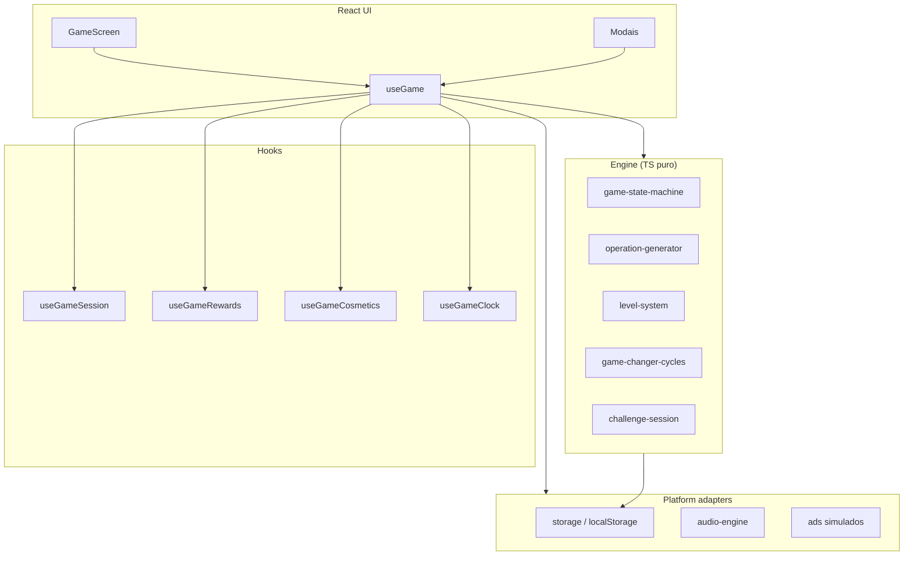

# Project Math

**Jogo de cálculo mental mobile-first em PWA** — resolva operações em cadeia, entre no flow e bata seu recorde.

> **Nomenclatura:** *Project Math* é o nome do **projeto** (repositório, pasta, documentação interna). O **nome comercial na loja** ainda está **TBD**.

| | |
|---|---|
| **Versão** | 0.1.0 |
| **Plataforma** | PWA web (instalável no celular) |
| **Idioma** | pt-BR |
| **Deploy** | Firebase Hosting (`project-math-c9545`) |

---

## Sobre o jogo

O jogador vê uma coluna com três campos: **número base**, **operação** e **resposta**. Cada acerto confirmado transforma o resultado no próximo número base e gera uma nova conta. A dificuldade cresce pelo **tempo disponível por operação** (ritmo 1–5), não pela complexidade matemática — o foco é exercício cerebral e estado de flow.

```
Ciclo 1:  [ 9 ]  +  [ + 2 ]  →  digita 11  →  confirma  ✓
Ciclo 2:  [ 11 ] +  [ × 3 ]  →  digita 33  →  confirma  ✓
Ciclo 3:  [ 33 ] +  [ ... ]  →  ...
```

Operações inteligentes com inteiros de 0 a 99 (`+`, `−`, `×`, `÷`). Confirmação explícita (botão ou Enter) — sem auto-submit. Erro preserva o valor digitado; timeout encerra a partida.

Especificação completa de regras e telas: [`docs/jogo.md`](docs/jogo.md).

---

## Funcionalidades

### Gameplay

- Loop completo com timer decrescente, score (+10 por acerto) e game over por timeout
- **Game changers** laterais em ciclos probabilísticos (auto-check, 4s, ×÷, +, −)
- **Auto-check** persistente entre partidas — carteira consumível no timeout
- Teclado numérico customizado, mobile-first
- Tutorial interativo guiado (18+ passos)
- Modo benchmark/dev para diagnóstico de performance

### Meta-game e retenção

- Perfil do jogador: nome, avatar, XP, nível (500 XP/nível), moedas e diamantes
- **Meta diária** — soma de score do dia; reset em `America/Sao_Paulo`
- **Top 5 recordes** com score, data e duração da sessão
- **4 modos de desafio** com rotação diária: moedas em dobro, 60 segundos, 3 segundos, só ×÷
- **26 conquistas** em catálogo (nível, score, desafios, loja, tutorial, etc.)
- Compartilhar placar — card 1080×1350 via Web Share API ou download

### Cosméticos e economia

- **11 temas visuais** (default, water, sunset, forest, violet, ember, neon, midnight, retro, ice, aurora)
- Loja com temas, badges, estilos de teclado e efeitos de tag
- Moedas pós-partida (`floor(score / 10)`)
- Anúncios rewarded **simulados** (2/dia → +1 auto-check) — adapter pronto para AdMob

### Plataforma

- PWA instalável com cache offline parcial (Workbox)
- Engine de áudio customizada (Web Audio API) com SFX por tier
- Persistência local via `localStorage`
- God mode (dev) via feature flag

---

## Stack tecnológica

| Camada | Tecnologia |
|--------|------------|
| Linguagem | TypeScript 6 |
| UI | React 19 |
| Build | Vite 8 |
| Estilos | Tailwind CSS 4 |
| Animações | Motion 12 |
| PWA | vite-plugin-pwa + Workbox |
| Testes | Vitest 4 + Testing Library + jsdom |
| Lint | ESLint 10 + typescript-eslint |
| Deploy | Firebase Hosting |

**Planejado (ainda não implementado):** Capacitor (Android/iOS), AdMob, RevenueCat, backend (leaderboard/analytics).

Detalhes de arquitetura alvo: [`docs/tecnico.md`](docs/tecnico.md).

---

## Pré-requisitos

- **Node.js 22+** (mesma versão usada no CI)
- **npm**
- **Firebase CLI** — apenas para deploy (`npm install -g firebase-tools`)
- **ffmpeg/ffprobe** — opcional; o build de áudio funciona sem eles (modo `files` com manifest commitado)

---

## Instalação e uso

```bash
git clone <url-do-repositorio>
cd project-math
npm install
```

### Desenvolvimento

```bash
npm run dev
```

Abre em `http://localhost:5173`.

### Build de produção

```bash
npm run build
```

Pipeline: `build:audio` → `tsc -b` → `vite build` → output em `dist/`.

### Preview local do build

```bash
npm run preview
```

### Deploy (Firebase Hosting)

```bash
npm run deploy
```

Executa lint + testes + build e publica em `dist/`. Requer login prévio no Firebase CLI (`firebase login`).

---

## Scripts NPM

| Script | Descrição |
|--------|-----------|
| `dev` | Servidor de desenvolvimento (Vite) |
| `build` | Build de produção |
| `build:audio` | Gera/atualiza manifest de áudio (`scripts/build-audio-sprite.mjs`) |
| `preview` | Preview do `dist/` |
| `lint` | ESLint em todo o projeto |
| `test` | Testes unitários (single run) |
| `test:watch` | Testes em modo watch |
| `ci` | `lint` + `test` + `build` |
| `deploy` | `ci` + `firebase deploy --only hosting` |
| `generate:pwa-icons` | Regenera ícones PWA a partir de `public/logo-math.png` |
| `bump` / `bump:patch` / `bump:minor` / `bump:major` | Bump de versão sem git tag |

---

## Variáveis de ambiente

Copie `.env.example` para `.env` (opcional em dev):

```bash
cp .env.example .env
```

| Variável | Descrição | Padrão |
|----------|-----------|--------|
| `VITE_SHOW_GOD_MODE_TOGGLE` | Exibe toggle "God Mode" no modal Config (compras a 1 moeda) | `false` |

Leitura centralizada em `src/config/env.ts`. Variáveis expostas ao cliente precisam do prefixo `VITE_`.

---

## Estrutura do projeto

```
project-math/
├── .github/workflows/ci.yml   # CI (lint + test + build)
├── docs/                      # Specs, sprints, relatórios
├── public/                    # Assets estáticos, áudio, ícones PWA
├── scripts/                   # Build de áudio, ícones PWA, bump de versão
├── src/
│   ├── engine/                # Lógica pura de jogo (sem React)
│   ├── platform/              # Storage, áudio, ads, device
│   ├── hooks/                 # Orquestração (useGame e hooks focados)
│   ├── context/               # GameProvider / GameContext
│   ├── components/
│   │   ├── game/              # GameScreen, keypad, timer, menu HUD
│   │   ├── modals/            # Jogador, Loja, Config, Desafios, etc.
│   │   └── ui/                # Modal base, MotionProvider, toasts
│   ├── cosmetics/             # Catálogos de temas, badges, loja
│   ├── achievements/          # Catálogo e avaliação de conquistas
│   ├── challenges/            # Catálogo e rotação de desafios
│   ├── styles/                # CSS por tema + HUD, menu, modals
│   ├── config/                # Feature flags, versão da app
│   └── utils/                 # Share score card
├── tests/                     # Testes da engine e platform
├── index.html
├── vite.config.ts             # Vite + PWA + Vitest + code splitting
└── firebase.json              # Hosting SPA + headers de cache
```

---

## Arquitetura

A lógica de jogo vive em `src/engine/` — TypeScript puro, sem imports de React, testável com Vitest em ambiente `node`. A UI orquestra via `useGame` (composição de hooks especializados) e `GameProvider`.



**Padrões adotados:**

- Engine isolada + adapters de plataforma
- Estado via React Context + hooks (não Zustand)
- Temas cosméticos via CSS variables (`src/styles/themes/`)
- Code splitting manual: `motion`, `react-vendor`, `vendor`
- Persistência com migração de chaves legadas (`project-math-player`)

---

## Testes

```bash
npm run test          # single run
npm run test:watch    # watch mode
```

- **Runner:** Vitest 4 (config em `vite.config.ts`)
- **Ambiente padrão:** `node` (engine pura)
- **UI/hooks:** `// @vitest-environment jsdom` por arquivo
- **Setup:** `tests/setup-dom.ts` (jest-dom matchers)
- **~108 testes** em 20 arquivos (`tests/**` e `src/**/*.test.ts(x)`)

Cobertura principal: operation-generator, level-system, game-state-machine, game-changer-cycles, challenge-session, storage, achievements, hooks de sessão/recompensas.

---

## CI/CD

GitHub Actions (`.github/workflows/ci.yml`):

- **Trigger:** push e PR em `main` / `master`
- **Steps:** `npm ci` → `npm run ci` (lint + test + build)
- **Node:** 22 com cache npm

Deploy é **manual** via `npm run deploy` — não automatizado no CI.

---

## Documentação

| Documento | Conteúdo |
|-----------|----------|
| [`docs/jogo.md`](docs/jogo.md) | Regras, telas e estados do jogo |
| [`docs/tecnico.md`](docs/tecnico.md) | Stack, arquitetura e modelos de dados |
| [`docs/fases.md`](docs/fases.md) | Fases de desenvolvimento (F0–F9) |
| [`docs/projeto.md`](docs/projeto.md) | Plano de mercado e roadmap (M0–M6) |
| [`docs/sprint-3/`](docs/sprint-3/) | Meta-game, retenção e monetização leve |
| [`docs/desafios-game-design.md`](docs/desafios-game-design.md) | Design dos modos de desafio |

---

## Status do projeto

| Fase | Status |
|------|--------|
| F0 Scaffold | ✅ |
| F1 Wireframe jogável | ✅ |
| F2 Core gameplay | ✅ |
| F3 Playtest / validação | ⚠️ Em andamento |
| F4 Polish visual e sensorial | ✅ |
| F5 Infra (CI, testes, PWA, deploy) | ✅ |
| F6 Android (Capacitor) | ❌ |
| F7 Economia e loja | ✅ (substancial) |
| F8 Monetização real (AdMob, IAP) | ❌ |
| F9 Lançamento em loja | ❌ |

O produto está **além de um MVP wireframe** — loop polido, meta-progressão completa, PWA instalável e deploy web funcional. Próximos passos: playtest formal, empacotamento mobile e monetização real.

---

## Licença

Projeto privado (`"private": true` em `package.json`).
